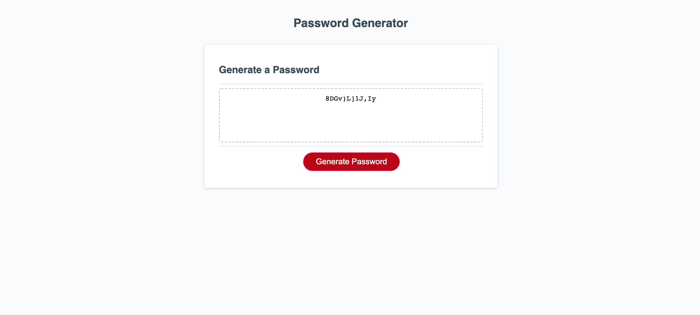

# Password Generator Starter Code

Description

This challenge is to create a password generator. 
The purpose of this is to use JavaScript to generate a random password that is requested from the user.

Screenshot

My Links:

https://rtleib.github.io/password-generator-challenge-03/

https://github.com/rtleib/password-generator-challenge-03